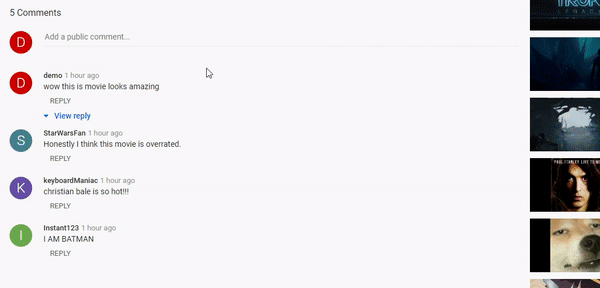

# NewTube

Welcome to Newtube! This project is a pixel perfect clone of Youtube. You can see the live version [here.](https://new-tube-app.herokuapp.com/#/)

NewTube is a clone of YouTube with functionalities such as signing up, viewing, searching and uploading videos. In addition, users of NewTube are able to subscribe to other channels, like and comment on videos as well.

## Technologies

- Frontend:
    - React
    - Redux
    - HTML 5
    - CSS 3
- Backend:
    - Ruby on Rails
    - PostgreSQL
- Heroku (website hosting)
- AWS S3 (image and video storage)

## Features

### User Authentication
- Users are able to create new accounts or login if they are already registered as well as logout or signing in with a demo account. Newly created accounts are also assigned a color that shows up in the profile icon to give each user a unique quality.

### Video Upload
- Existing users can upload their own videos with a required thumbnail image, and owners of their videos have the option of deleting them.

### Comments section
- Videos can be commented on, and comments can also be replied to. This is achieved through polymorphic associations, making comments and videos both commentable types.

### Subscriptions
- Signed in users can subscribe to multiple NewTube channels, and their subscriptions show up in both their profile page and the modal side navigation bar. 

## Additional Features
- Search
    - Users can search for videos based on their titles with the search-bar.
- Likes / Dislikes
    - Users are able to like or dislike videos.
